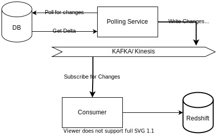
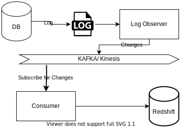
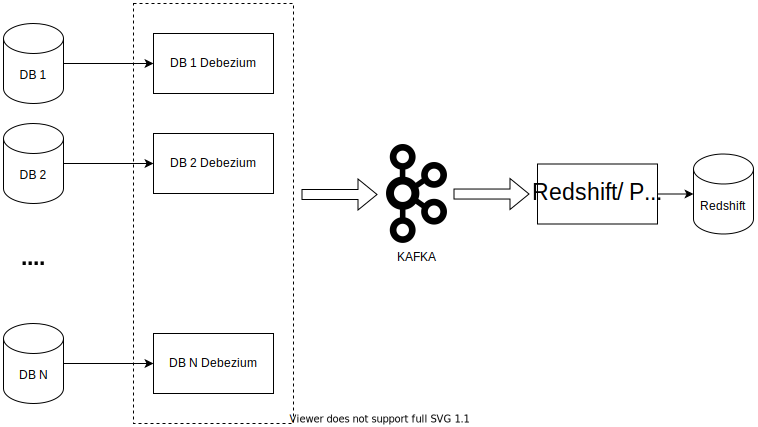

We helped build an *Enterprise Information Dashboard* that aggregated data across its tenants and helped them power a dashboard helping them with a unified data visibility.
In this first part of the blog, where I talk about the path we took to move the data into the data lake. We'll look into how it was transformed and presented in the next part.   

## TL;DR

Data that was spread across 120+ DB instances ( tenant specific sharding ) was pulled into AWS Redshift into *Staging Tables*.
We were able to achieve the same using AWS DMS, writing configurations using its JSON transformation rules.

## Current System and Problem Statement

Our client provides whitelabel solution of a financial product with over 120+ customers(tenants). They had their data sharded and isolated at a tenant level, with different DB instance per customer. 
Depending on the functionality, they also had the data split across databases, viz. lookup DB, transaction DB, customer DB etc. On top of this, some customers were available across regions ( IN, SG, NA etc. ). For each of these regions, the tenants had a separate DB instance as well.

The schema across these different DB instances were different in most cases. To address quickly changing customer needs, each tenant's tables could have more or less fields, or additional tables. 
Standardization of data through **One Script** is not going to work in our case.  

With these requirements in mind, we split this overall problem statement into 3 major groups.
* Ingestion 
* Conversion 
* Presentation

We also had to consider, as part of the solution
* Ease of on-boarding a new tenant
* Ability to customize the dashboard
* Familiarity of technology for in-house devs for future enhancements and maintenance
* Role Based Access Control
* AWS as the platform

## Redshift for Data Lake

As mentioned earlier, familiarity of technology was an important factor while coming up with overall solution. 
So we put our initial effort into identifying the technology to be used for building the data lake first. 

We had many options but chose [AWS Redshift](https://aws.amazon.com/redshift/) as our choice as 
* Familiar interface based on SQL  
* Low or no learning curve
* AWS based solution 
* Performant queries with proper sort and distribution key

## Ingestion

Data ingestion required a one time import of existing data as well as ongoing sync of data.
This required identification of changes, and propagating them to the Data lake platform. 

We can achieve the same through 
* Intrusive techniques - viz. changing the code to push the data to the Data lake
* Non-Intrusive techniques - viz. looking into DB changes and replicating the same into the Data lake

The intrusive technique was easiest and cheapest way to push the data, but it involved 
* Changes to existing code
* Handling of logic across different languages ( Java, Go and Python, which were already in use )
* Documentation and setting up process, to ensure future code changes do not miss the sync. 
* DDL changes will require manual handling at the data lake end as well to propagate the changes.
* Coordination, testing, and deployment of many services across tenants

This was risky and increased the time to market, thus making us adopt a non-intrusive technique for data replication. 

While looking into Non-Intrusive techniques, we had 2 possible ways of handling the same

* Poll the database at regular intervals, and pull incremental data from the tables
* Look for changes in Binary Logs or OpLogs and replay them

## Poll and Pull



This method involved writing a script that would pull the data in regular intervals from each of the tables of the DB and push them to a data stream. 
A script per DB can be implemented and the data can be produced by many such services. These stream of data changes will be consumed by a downstream application, 
that would be responsible for pushing the data changes to Redshift. 

As a general rule, we will only pull the "Delta" and not the full data as it will have performance ramifications. Identification of the Delta would happen based on available Audit Columns.
The last processed date from the audit column would be made a note of and would be used as the reference for next pulls. 

We found this to be a desirable approach as
* The scripts can be per DB, which means we can do the transformation as part of the pull operation
* In case of pull system crashing, the restart can be quite simple to handle, as we can catchup from where we left last
* The frequency of pull can be changed and controlled per DB basis as well depending on the growth of data
* Simple design in comparison to other non-intrusive techniques 
* Querying against read-replica of the DB will ensure primary DB is not impacted

BUT we were unable to adopt this technique due to one major issue. *Not all tables had proper **Audit Columns***. 
Finding delta through any other technique would be contrived and error-prone. 

## Observing Binary Log Changes



The database as an audit mechanism will log every change that goes into it. These can be both DML or DDL statements, that can add/modify data or structure.
When logged using a "ROW level logging" format, every change is captured as part of the binary logs.

We wanted to build a service that would look for changes in the bin-log and would be able to use this information to replicate the data into Redshift. 
This service should
* Automatically restart in case of crash ( like a systemd process )
* Log from where it left last time in case of restarts
* Binary log retention policy of DB to be setup appropriately to ensure the process would well and at the same time not impact DB
* For failures spanning beyond more than the retention time, a strategy to capture delta needed to be worked out.
* Handle identification and propagation of DDL changes automatically to Redshift.

Rather than reinventing the wheel, we looked at leveraging existing solutions.

## Debezium

[Debezium](https://debezium.io/) is an opensource platform that captures data changes and streams them into a KAFKA topic. 
It looks into the binary log of the database and throws events of every change that occurs in the DB. 

Every change is emitted as json that indicates the nature of operation ( Insert, update or delete ), along with timestamp, and before and after change states.
These are published as events in a KAFKA topic which can then be consumed and used to push data into Redshift. Debezium has connectors for popular Databases as well which makes development effort to be close to nothing.



But Debezium came with a complex infra setup which included KAFKA, a service that keeps running the Debezium server and consumer, which requires additional monitoring in place. 
We also had to think about the strategy to move the initial data to redshift and in case of long failures, a strategy to identify delta and load them. 

The time to market and ease of maintenance was critical for us, and we started looking into other options.

## AWS DMS

[AWS Data Migration Service](https://aws.amazon.com/dms/) provides what Debezium does along with 

* Data sync in case of first time or delta
* Self-managed services hiding all complexities of how data is moved from DB to Redshift
* First class support for DB hosted in RDS and Redshift.

This ticked all the right boxes for us, and we pursued the same.

DMS provides a tool called the [Schema Conversion Tool](https://aws.amazon.com/dms/schema-conversion-tool) that can be installed in your computer. 
You open the tool, provide the details on source DB and the destination to which it needs to be migrated to. 
The tool connects to the source, identifies all the DB objects and comes up with a report on whether of not a direct migration is possible. 
Fortunately for us the migration was straight forward as DB specific features were not used.

For DMS to work a few DB level settings are required
* **binlog_format** should be set to **ROW**
* **read_only** flag to be set to **0** for allowing write access
* **log_bin_trust_function_creators** should be set to **1** to allow DMS to get triggers for every data change in binary log

Instead of making these changes in the primary DB, we made these in the read replicas, so that there won't be any undesirable impact. 

Finally, the process of data migration involves 
* Creating a Data collector which spins up an instance
* Adding an endpoint for source and destination DB
* Adding a task to the Data collector for each of the source DBs with the destination to be same redshift. 

This would also require an additional S3 bucket that would be used to temporarily store data during migration. 

While creating the task, you can provide specific schema names to be created while moving the data. We used this to differentiate the various source Databases in our staging tables. 
This would mean that we will have to add *transformation rule* that would map tables to the destination. 

Though there is a handy wizard that helps you to achieve the same, doing it repeatedly for individual tables of each DB, belonging to each functionality, tenant and region would become too tedious. 

This is where we used the **JSON transformation rules** instead of the wizard. We used a rule to rename the schema when on-boarding data. The sample JSON would looks like below. 

```json
{
    "rules": [
        {
            "rule-type": "transformation",
            "rule-id": "1",
            "rule-name": "1",
            "rule-action": "rename",
            "rule-target": "schema",
            "object-locator": {
                "schema-name": "%",
                "table-name": "<TABLE_NAME>"
            },
            "value": "<TARGET_SCHEMA>"
        }
    ]
}
```

For every table belonging to a tenant, region and function a transformation rule was added to move it to it's corresponding schema.
This way we were able to onboard each of the tenant's tables into separate schemas which was our staging schemas.

We developed a UI screen as part of the bigger platform ( which will be discussed in the next part of the blog ), that would automatically generate this JSON configuration based on onboarded tenants. 
This made on-boarding the tenant databases a simple task. 

## Data format

As mentioned earlier, we needed to import data from tenants, across regions and functionalities. 
We created a schema per DB in redshift, and named the schema with a **TENANT_REGION_FUNCTION** format. This way data from each of the DB were created inside its own schema. 

A task is created per datasource which brought the data into redshift.  


As next step, we had to pull data from each of these schemas and create them as Facts and Dimension tables to be used for data analysis ( Snowflake schema ).

## Next 

In the next blog, I'll talk about how the different tables in different schemas were made into a common format and transformed into facts and dimensions. 
We'll also discuss the platform that was built to help the client onboard with ease.
