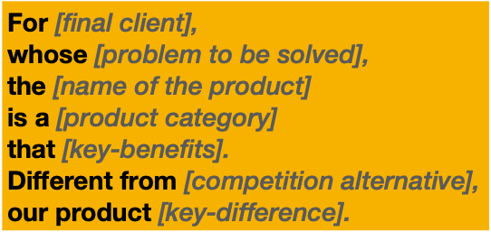

# Running an Inception - My thoughts

My journey into the agile world (still using the verb agile over the over used noun) started from my Ford days, where we had attended workshops on running an agile project, customizing and evolving the process over a period of time with the process that works and makes sense ( truly being agile ) and these principles have stuck on to me for good.  

When I worked as a Product Manager at Ford for FordPass and LincolnWay apps,  I got the opportunity to pair and work Product Managers at Pivotal Labs, who introduced me to a bigger world, which can help us to get started with a project and run it successfully and deliver value for money.
 
After joining Ajira that became our way of life and we do things that make sense for the project and help us deliver best value to our customers.   

I was hoping to put together some of my experiences around the same and thought of starting off with the process of inception - how can we start the project, to ensure we know what we need to build. 

As I mentioned earlier, these are general tools/ techniques that can help us understand the customer's needs better to build a product that they actually want. There are no hard and fast rules to adhere these strictly as agile is adoption of process that makes sense and that's what made sense to us too. 

## Inception

Inception is a workshop that generally happens for about 5 days, where all the stakeholders of the project are available at one place and the project requirements are discussed together as a group and we come to a consensus as well as a group.
This is also a process where we identify responsibilities and assign it to each stakeholders, define and communicate the process that we would be following as part of the project, such as the agile ceremonies, showcases, acceptance methodologies etc. 

Generally the stake holders are people such as 
* Product Owners
* Business Owners
* Technical Team
* End Users

to name a few

The rest of the blog talks about what we do as part of this workshop. 

### 1. Introductions - Break the Ice

_Session For: Product Owners, Business Owners, Technical Team, End Users_

#### This session helps in
 
- Breaking the ice
- Know the different stake holders
- Walk them through the high level workshop agenda

#### What do we do
We can follow the below pattern across the board. 

### 2. Defining the Product Vision

_Session For: Product Owners, Business Owners, Technical Team, End Users_

#### This session helps in

- Identifying Project/Business Goals ( Why this product? )
- Identify the impact that is needed to reach the goals ( What does it do? ) 
- Identify the target group ( Who is is for? )
- To define at a high level
    - what the product is, 
    - what it is not,
    - what it is expected to do, 
    - what it won’t be doing 

#### What do we do

- Write the product vision template in a whiteboard for the whole team can see.
- Divide the team into smaller groups and ask each one to fill the blank slots.
- Gather the results of each group to form the final statement.

The statements can be written by each of members in the below format. 

### 3. Identifying Project Goals - Is / Isn’t / Does/ Doesn’t

_Session For: Product Owners, Business Owners, Technical Team, End Users_

#### This session helps in

- Identification of Product/Project Goals

#### What do we do

 - Divide a white board into four areas: Is / Is not / Does / Does not.
 - Write the name of the product above the quadrants.
 - Ask each participant to describe the product by putting post-its onto the
corresponding areas.
 - Read and group similar notes.

### 4. Persona Workshop

_Session For: Product Owner, Technical Team, End Users

#### This session helps in
 - Identify different types of users 
 - Identify different system interactions 
 - Identify their needs and goals

#### What do we do
 - Based on the outcome of user research, we pick different types of users one at a time. 
 - Divide the existing people into smaller groups
 - Each group to come up with a persona for the selected type of user/ system based on the template
 - Each group to present it’s persona to the rest of the team 
 - Vote for features to identify a unified persona

At the end of this exercise, we come up different users of the system and their demographic information. 
This will help us build better use cases targeting the specific needs of the audience.

### 5. Feature Discovery: Persona - Goal Mapping

_Session For: Product Owner, Business Owners,Technical Team and End Users_

#### This session helps in

- Identify features
- Identify how the features helps the Persona’s reach their goals

#### What do we do  

 - Put the product goals as column titles on the board. Prioritise these goals from left to right, high to low.
 - Put the personas as row titles in priority order from top (high) to bottom (low).
 - Everyone suggests features and places them on the table. Use the personas and goals to guide the discussion. The key question is “what does the product need to do so that this persona reaches this goal”.

### 6. User and Data Journeys

_Session For: Product Owners, Business Owners and Technical Team

#### This session helps in

- Identify User and Data Journeys
- How each steps the persona needs to do to achieve their goals

#### What do we do

- Select a persona.
- Identify a goal for this persona.
- Write the persona and their goal on a post-it and place it on the top
- Decide the starting point write this starting point on a post-it and put it on the canvas.
- Describe each following step on a post-it and place it next on the canvas. Continue placing steps until the persona achieves their goal

### 7. Mapping Journeys to Features

_Session For: Product Owners, Business Owners and Technical Team

#### This session helps in

- Identify missed out features
- Identify order of feature development
- Identification of unwanted features

#### What do we do

- Put the journeys and the features side by side
- Take each journey, and for each step, record any features that it needs.
- For journeys missing features, create feature cards.
- Some features are not mapped to journeys, discuss if we really need them

### 8. Prioritisation : 2 X 2

_Session For: Product Owner, Business Owner, Technical Team_

#### This session helps in
 - Identify the priority of each feature
 - Place them in a quadrant based on value added vs technical complexity
 - Order the features based on the exercise
 - Identify low priority features as well.

#### What do we do

- For each of the features, business owners to place them on the y axis with most value added on top vs least value added on the bottom.
- For each of those features, ask the technical team to move them horizontally, by placing the most complex to least complex from left to right
- Divide the board into 4 quadrants and prioritise features based on the same.

### 9. Stake Holder's Map

// TODO

### 10. Retrospection

// TODO

### Miscellaneous 1 - Understanding current System : Mind Map

In situations where the project is re-writing of an existing system, or involves heavy integration with an existing system, we can use this technique to try and understand the system. 
This exercise is taken up before the persona workshop and the inputs from the same are used for identification of the personas from this exercise. 

_Session For: Product Owners, Business Owners and Technical Team_

#### This session helps in

 - Understand the various components of the current systems
 - Understanding current users and their interactions with the system
 - Understand the data flows and transformations 
 - Identify pain points/ challenges
 - Identify system and user persons
  
#### What do we do

- Identify a central system and write it’s name in a sticky
- Add the Purpose, Users, Functions and Tech stack as sticky below them.
- Identify Upstream systems and down stream systems and create different stickies for them. 
- Show details on how the systems are connected.
- Perform the same steps with the identified upstream and downstream systems

// Write example for each. Take a single example and run it thru. 

