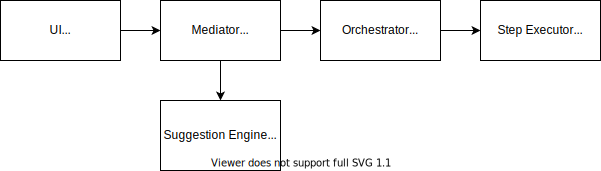

# Building A Cloud Migration Platform - Part 1 : Provisioning the infrastructure

A recent change in our Org, all the applications are required to be moved to GCP as part of a strategic decision. 
Most of our apps run out of Azure today with a few services deployed in AWS as well, with tons of other apps running out of on-prem datacenters. 

There has been lots of work done by different people across different teams to migrate their apps into GCP. Though there is generally good sharing of information, 
the loss of information exchange is also quite common due to the shear size of the organization. Another major problem is lack of working knowledge in GCP, which is an org wide issue. 
Not every one is aware of the best practices that needs to be followed as part of their provisioning of infrastructure, which components to choose etc. and there still exists a lot of learning curve to go through. 

Recently as part of the GCP adoption initiative, we had a hackathon conducted and we pitted in with a solution to make things simple for teams to move to GCP. 
I'll share my thoughts on how we approached the problem statement as part of this blog series. As part of this blog, we will see how we approached the problem of provisioning the infrastructure components in GCP. 

## TLDR;

We built a stateless microservice - "Step Executor", that takes in request to trigger a Terraform script and respond back with the step output. 
A GCP component provisioning might need provisioning of other components as pre-requisites. These we modelled it as a Plan with multiple steps. 
Each step is a terraform script, and a plan consists of multiple smaller steps. 
The execution of a plan and it's many smaller steps is handled by another microservice called the "Orchestrator" that executes the steps in sequence.

## Overall Application

We planned to build a platform that would be able to 

* Understand the application that needs migration
* Identify the current components used and the infrastructure in which they are deployed ( Azure/ AWS/ On-Prem )
* Suggest GCP specific alternatives, and come up with a migration plan
* Auto provision the components identifed
* Provide a platform that can also act as a source for all the application information ( like a keyvaule ) 

So the flow can be broadly represented as 

Our overall architecture had the below components 

| Service/ Component | Description | 
|---|---|
| UI | A react based UI application, that was used for user interactions |
| Mediator | A spring boot application, which acts as the backend for the UI, and is responsible for identifying the components from the user and works with other services to identify and provision the components. |
| Suggestion Engine | An engine that takes the current application information to suggest a migration plan. Built as a spring boot application this integrated with many other services for analysis and prediction | 
| Orchestrator | A spring boot service, that takes a migration plan, and orchestrates the creation of components in GCP |
| Step Executor | The Node and Typescript application that triggers terraform scripts for the actual provisioning of components, based on the inputs passed from Orchestrator | 

In this blog post, we'll specifically how we designed and developed the Orchestrator and Step Executor components. 

## Provisioning of GCP Components

We decided that to automate the provisioning process, it is essential that we codify the process. We had options to choose from and the major 2 options that we wanted to leverage were **Terraform** and **Google Cloud Deployment Manager**. We decided to go with terraform as it would provide a way to make the solution platform agnostic. So in case of a shift in company strategy in future to choose a different cloud service, the platform would require re-work only on the Terraform scripts, with the rest of the services being intact. 

Typically a component provsioning might also need provisioning of related components, before the actual component is provisioned. For example, if one of the requirement is to create a Postgres DB in GCP's Cloud SQL, it would require creation of VPC and Subnet inside which the DB needs to be provisioned to provide it with required level of network isolation and security.  So this would mean that for spinning up a DB I need to 

1. Provision a VPC 
2. Provision a Subnet inside the VPN
3. Pass the subnet information while Spinning up the DB

We call this an execution plan or to put it simply **Plan**. A plan consists of many individual steps. In the case above, the plan has 3 steps, viz. Provisiong of  VPC, Subnet and DB. A step can have inputs that are passed from the user, or from one of it's previous steps. 

For Example, a database provisioning needs the Size and Name of the DB, that would come from the user, whereas the subnet under which it needs to get created would come from it's previous step. 

Addition to the inputs from the user provisioning of infrastructure also needs security. Each team needs to isloate their components from the others and they will behave like an org of their own. So each team will have to pass their own security for provisioning their components. 

So in short, during each step's execution, terraform would take the user/step inputs and security details to execute the script and provision a single component.

With the above information in hand, let's take a look into how we were able to pull off an actual implementation. 

## Step Executor

Step Executor was a service that exposed a single POST endpoint, to which we can pass a set of input and security information, based on which it would choose and run a terraform script. The endpoint would handle the request in an async fashion and will make a call back to a webhook endpoint exposed at the "Orchestrator Service" ( to be discussed later ) with the output from terraform. 

