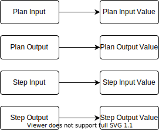

In the [Part 1](https://techmusings.dev/buildingACloudMigrationPlatformPart1ProvisioningTheInfrastructure) of the blog, we saw the motivation behind the project and how we built the Step Executor for executing Terrform scripts.
In this post we'll look into the **Orchestrator** which helps in orchestration of multiple terraform scripts and provide the collective results back to the calling place. 

## TLDR
A component creation may need other pre-requisites to be created. The orchestrator, identifies the execution plan to create the component by orchestrating it's dependencies before creating the intended component. The design is motivated from how a CI/CD pipeline is built with multiple steps and running them in series.

## Component dependencies

A typical use case we were trying to solve was a request for provisioning components such as a Cloud SQL DB. The creation of this component will require inputs such as 

* Type of Database
* Database Name
* Admin user name
* Project under which it needs to be created
* DB Version
* Charset
* Collation
* Disktype
* Activation policy 
etc... 

Of these, some can be safely defaulted at the organization level. These defaults being part of terraform script would be a bad idea as it would bring in a tight coupling. Similarly some of the inputs cannot be defaulted and needs to flow in as user inputs. 

Apart from this, the creation of the component would need other dependent components to be created first. For example, the postgres DB would require a VPC and Subnet to be created before provisioning the DB itself. This can be handled either at the terraform script where the prerequisites are provisioned before the actual component. But in most cases, the VPC and subnets are pre-created and may not be required to recreate. Therefore keeping these component provisioning as part of the same terraform script would create a tight coupling. 

We now have 2 important considerations for creating a component

1. Safe defaults of inputs at an organization level for each component
2. List of dependent infra components to be provisioned before creating the intentended component.


To solve this, we generated an "Execution Plan" for the component's provisioning. With the execition plan in place, the Orchestrator would orchestrate the steps in them by calling step executor and collating it's results. 


## Execution Plan

I had mentioned that the overall design was inspited by a CI/CD pipeline where a pipeline can have many tasks which configured to be exeuted in parallel or series and often there are cases where the output from a previous step are used as input in subsequent steps. 


Similarly we designed our system to have a root component called the "Execution Plan" or just a "Plan" for brievity. The plan consists of individual steps. Each step in this case are individual terraform executions ( executed by Step Executor ). A Plan will have user inputs, which as discussed earlier will have definition of all possible inputs required for creation of the component.  


Similarly each step will have step inputs, which would be passed down to the Step executor for executing the terraform script. Interestingly the step's input can come from either the plan's input or from the output of each step. Thus the output from each of these steps were also defined. 
A step input mapping was defined to tell whether the step gets its input from user or a previous step's output. 


The complete plan's output was captured which is basically outputs from individual steps. Our overall model looked like below. 


## Handling the inputs

By defining the Plan, we were able to solve the component pre-requisite identification. We still had to provide the system the ability to provide defaults. For this, we captured for every plan's input a Plan Input Default values. 

We also realised that some of the inputs being present or absent would change our execution plan. For example, A VPC or a subnet value could be passed as a user input if they are available. Their presence or absence would lead to changes to the execution plan where we may or may not need included or execulude the dependent steps. 


We captured this through a nullable field referencing a step or plan input. This helped us identify the steps that can be avoided in case the value gets supplied. We handled the code to pass "user input" rather than from the "previous step output" in these cases based for step input. 


These changes helped us in 

* Fully flexible and indepdendent Terraform scripts
* Configurable defaults stored as part of tables
* Generation of "Execution Plan" depending on the inputs


## Executing the Plan

With the above changes, we were able to successfully capture the information required to generate a plan and execute it. Execution of the plan was done at a request level. Every request requires capturing information of Plan Inputs, Step Inputs, step outputs and the plan output. 


For this reason, we created a set of "Value" tables, which would be used to capture the above mentioned information. All the information across these tables were linked together using a "traceId" which is passed from the caller's location ( Mediator ). The traceId is also passed down to the Step Executor, which uses it as part of its calls back to the "Orchestrator". 



Once all the steps in the Plan were executed, the Plan output values were populated and a call is made back to Mediator with the traceID and the output values of the Plan. 


## Changes to Step Executor

We created a spring boot application, created the tables with Flyway migration, persisted our data into a postgres DB. While doing so, we continued to keep the stepName consistent between Step Executor and Orchestrator. This enabled Step Executor to identify the scripts correctly based on the name that was passed to it. 

But as we started splitting, refactoring and adding more scripts, we realised that human error is something that cannot be avoided and this solution will not scale. 

So we moved the terraform scripts to a google object store. The location of these script were captured as part of the step information. This information was  inturn passed down to the "Step Executor" as input. The step executor's body changed as shown below. 

```
{
    "traceId": "traceID from the requesting system", 
    "stepLocation": "location of the script in google object store"
    "auth": { "type": "service_account",
      "project_id": "<project id from GCP>",
      "private_key_id": "<keyId>",
      "private_key": "<Private Key>",
      "client_email": "<service email>",
      "client_id": "<GCP Client Id>",
      "auth_uri": "https://accounts.google.com/o/oauth2/auth",
      "token_uri": "https://oauth2.googleapis.com/token",
      "auth_provider_x509_cert_url": "https://www.googleapis.com/oauth2/v1/certs",
      "client_x509_cert_url": "<client-cert-url>"
    },
    "inputs": [{
        "label":"input key as per terraform script",
        "value": "value for the given label"
    }, ...]
}
```

The step executor downloaded the script from the object store, there by eliminating storing the scripts as part of the code base. The step executor is now a stateless component which worked based on the inputs that was passed to it. The below sequence explains on how the overall execution happened. 


## Continuation

Orchestrator was able to capture the plan's information to generate an execution plan for the component creation. We did not develop any specific UI for the same and handled the values using migration scripts. We bundled the application with docker and deployed it into an [GKE](https://cloud.google.com/kubernetes-engine) cluster.


In our next part, I'll talk about how we managed to provide user interaction using the mediator service. 


