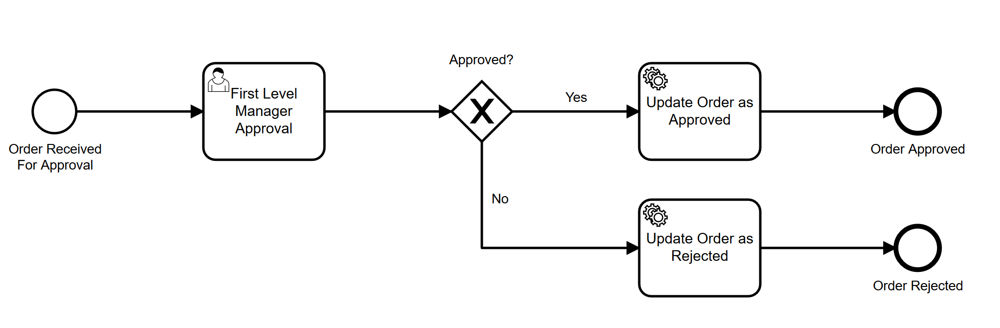
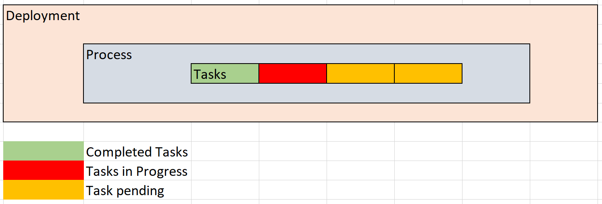

We had to, for one of our clients help them integrate Business process management(BPM) into their existing multi-tenant system, to power approval flows.
The solution had to 

* Easily import a standard BPMN 2.0 based definition and also let create one as well.
* Work with multiple tenants and ensure data does not get shared between user of tenants.
* Be Open source to keep the cost involved low. 
* Scale Easily.
* Be Customizable to meet their existing platform requirements. 

The rest of the talks about how we managed to accomplish that and the thought process that went into the building of the overall solution. 

# TL;DR
   
We integrated an Open Source Java based BPM system [Camunda](https://camunda.com/), that provides a way to add the complete platform as a 
spring application. Also we did not store any user information into the Camunda system and leveraged it's APIs to

1. Maintain the BPMN definition at the source system.
2. For every need for a business process a new Deploy of BPMN definition is done at Camunda
2. A task is then created to trigger the business process for the deployment. 
3. The deployment and task IDs were maintained in the source system
4. Make call backs using Listeners to notify when the task is completes to the source system.
5. Un-Deploy when the process completes. 

This helped us to keep things alive for a specific approval process and also helped maintain complete isolation between processes. 
This also potentially cleared all the headaches of maintaining the users across two different systems. 

# BPMN : A quick intro

Let us consider an editorial example that involves the following work flow. 

* An employee writes a piece of article and submits for review
* The article goes through a review engine, that based on the key words flags for sensitive material
* Based on the flagging level the article would go to  
    * Sub Editor in case of a normal one
    * Senior editor in case it's sensitive
* The reviewer looked into the article and can 
    * Approve it if it's good
    * Send back if there are changes needed
    * Reject it if it's not worth publishing
* After the above process the article gets
    * published and available for others to read if Approved
    * sent back to the employee who can rework on it and go through the process again
    * moves to the archive in case of Rejected

Typically we have a flow that can be defined here. A similar parallel can be drawn against many such situations which also works with enterprises and processes such as 

* Leave approval flow ( where it can be an immediate manager who would approve it )
* Procurement ( where there can be many levels of approval )
* Travel Requests  ... 

Typically the processes are defined by the business and there will be a team who would work on translating it to code. 
A BPM system acts as a bridge to make things more accessible to both the parties. 

It allows the business or the business analyst to draw the BLOCKS of and the connections between them. This is defined in the background as a XML following a standard called the BPMN2.0 notation.

Some of the types of blocks are
* **Start Node** that indicates the start of a flow
* **Task Node** which typically denotes an operation this can be 
    * **User Task** which needs a user to act upon ( like an approval process ) 
    * **Service Task** which helps in doing pre-built tasks such as calling an API, performing calculations etc. 
* **Conditional Node** which performs a conditional operation and determins the next flow 
* **End Node** that denotes a completion of the flow

The above figure shows these blocks put together to define a order approval workflow.  

# Why Camunda

While assessing multiple BPM solutions, we wanted a tool that is
* BPMN 2.0 compliant
* Opensource to keep the cost ( related to licensing ) low. 
* Easy to deploy and scale
* Ability to Customize easily for our requirements
* Decent community support for trouble shooting and upgrades

We looked into a number of options and liked Camunda the most because it fulfilled most of our needs. 
It also gave us the ability to wrap it up as a Spring Boot project with custom code handling.

The document was decent ( there were definitely places where we wished it could have been more intutive) and the code organization was easy to understand.
Most importantly it was build using Java, Spring and uses a RDBMS system in the backend which makes understanding and customizing it easier. 

# Camunda - Process flow

Before we get into solving the actual problem, a small primer on how Camunda works with respect to executing a BPM process. 

* Every BPMN file that we upload is deployed. We'll call this a deployment. This is associated with a "deploymentId"
* After a BPMN is deployed, it can be started. The equivalent is like deploying an application in a server and it's ready to take requests. 
* When an activity requires triggering of a business process, we use the "deploymentId" associated with the business process and we trigger a process. The process will be associated with a "processId"
* The process would typically consist of multiple task, each of which will be identified using a "taskId"
* Some of these tasks are user tasks.  User tasks will not execute until a user acts on it ( like an approve, reject, send back etc. )
* On completion of all the tasks, the process will also come to an end, leaving the BPM deployment to be alive. 

So every BPMN process that we need to execute will have it's own deployment. 
This deployment can inturn have multiple processes which inturn can have multiple tasks. 

As a special note, while executing user tasks, the user who needs to act on it (or a group of users in some cases), should be a part of Camunda's users to be able to perform the activity on the task. 
The user would have their own login and a list of work items they can act upon (examples tasks that require approvals).

Each process would relate to a specific business process execution.  With this primer in mind, we'll continue to the problem statement. 

# The Requirement - (Multi-Tenant X Multi-Processes)

The existing consists of an admin user (admin) and a normal user (user). The user can use the system to raise different kinds of requests.
Each request would now go to the admin for their approval and following which they get fulfilled.

Our customer wanted this to be changed to use a BPMN based flow to 

* Avoid having single point of failure on the Admin user for all the requests
* Adopt the system for enterprise usecases where typically depending on the type of the request, it would go through a different set of flow

Basically they wanted the ability to be able ot define different types of approval flow, and attach each types of request with a specific approval flow.
A few examples to make this more clear

* For a request type which may involve "install Firefox browser" in a user's machine may not need any approvals
* A request to apply for a duplicate ID card request would need approval from "reporing manager"
* A request to create an S3 bucket for their project would need approval from  "reporting manager", "architecture team" and "Finance Team"

So in each of the situations we will have a corresponding work flow defined to handle the approval flows.
Typially this means the user to whom the approval would be assigned to would be determined runtime, based on the requesting user/ type of request. 
Similarly the same approval may go to an individual (e.g. reporting manager) or to a group of people (e.g. Finance team).  
In most cases the user details of the tenants were coming from LDAP which means getting the corresponding user / users details at run time would be a query against thei LDAP. 

This means we need to handle the following

1. Have the ability to define different BPM processes in the system ( defined using BPMN )
2. Associate all the requests types with a corresponding BPM process
3. On creation of a request, depending on the type use the corresponding BPM process
4. Depending on the BPM process, have the ability to search for and assign approval to a user / group of users. 

It just get's better when these needs to be handled for multiple tenants as well.  Which means we need to bring

* isolation of process acroess tenants
* isolation of users across different tenants
* Depending on the tenant, the querying from LDAP will vary and that should be accomodated as a configuration.

# The First Iteration

Solving problems 1 and 2 looked quite straight forward. The BPMN definitions were created as deployments in Camunda. 
It's deployment ID and process Id were put into a workflow definition table along with meta-information such as name and description.
We ran a migration against the requestType table to include an extra column holding the workflowId and associate it with the corresponding workflow type. 
With this we were able to trigger a workflow everytime a request was created. 

# User Management Conundrum

# Keeping things stateless

# Final Solution

# Summary
